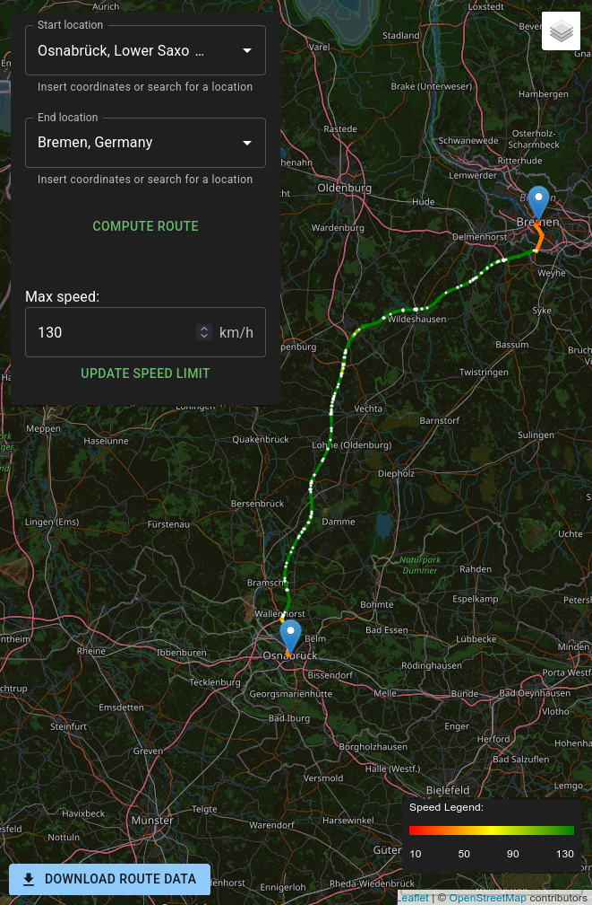

# ObLoS: Obstruction-Aware Packet Loss Mobility Simulation for LEO Satellite Networks

[](https://doi.org/10.1109/LCN67947.2026.11660807)
[](https://doi.org/10.1109/LCN67947.2026.11660807)

**ObLoS** is an open-source simulator that generates realistic **packet loss traces for Low Earth Orbit (LEO) satellite links, such as Starlink, used by moving vehicles**. It accompanies our paper at the *IEEE 51st Conference on Local Computer Networks (LCN 2026)*.

<p align="center">
  
</p>

## Motivation

LEO satellite networks are a key technology for continuous connectivity of vehicles, especially in rural areas. However, their performance depends on a clear line of sight (LOS) between the user terminal and the satellite. In vehicular scenarios, the LOS is frequently blocked by objects above the road, such as bridges, sign gantries, or tunnels, which causes short but significant packet loss bursts.

ObLoS analyzes the environment along a driving route, identifies objects that may obstruct the satellite link, and turns them into a time-resolved packet loss trace. We validated ObLoS against 41 real-world Starlink measurement drives. Simulated and measured loss patterns reach an average DTW similarity of 0.9947 and agree on ≈98.5 % of all 1 ms loss/no-loss samples.

To the best of our knowledge, ObLoS is the first obstruction-aware packet loss simulator for LEO satellite communication in mobile scenarios.

## How it works

1. **Route computation.** A route is defined either by start and end locations (place names or WGS 84 coordinates, geocoded via [Nominatim](https://nominatim.org/)) or by uploading a recorded GPS track. The route and the per-segment travel speeds are computed with [OSRM](https://project-osrm.org/). For recorded tracks, OSRM map matching annotates the actual driven speeds.
2. **Obstruction detection.** The route is queried against [OpenStreetMap](https://www.openstreetmap.org/) through the [Overpass API](https://overpass-api.de/) to find overhead objects: road and railway bridges, sign gantries, pipeline overpasses, wildlife crossings, tunnels, and more.
3. **Obstruction width estimation.** The width of each obstruction is taken from a fallback hierarchy:
   1. Official bridge data from the German Federal Highway Research Institute ([BASt](https://www.bast.de/)) (most precise, Germany only)
   2. Width tags in OpenStreetMap
   3. A neural network trained on OSM road features
   4. Rule-based estimates from OSM tags
4. **Loss trace generation.** From the obstruction width and the vehicle speed, ObLoS computes the time spent under each obstruction and emits a packet loss trace along the route timeline.

## Features

- Interactive web interface based on [Leaflet](https://leafletjs.com/) for planning and visualizing routes, color-coded by speed, with the detected obstructions shown on the map
- Two input modes: point-to-point routing or upload of a recorded GPS trace (JSON)
- Configurable maximum speed for uncapped highways
- CSV export of:
  - the simulated packet loss trace (`<route>_simulated_loss_trace.csv`: `timestamp,lossTime`)
  - the route segments with their speeds and obstruction times (`<route>_simulated_segments.csv`)
  - the obstacles detected along the route
- A reproducible data pipeline (`meta/`) to rebuild the bundled obstacle database from BASt and OSM data

## Getting started

### Prerequisites

- [Node.js](https://nodejs.org/) and [pnpm](https://pnpm.io/)
- Access to an [OSRM](https://github.com/Project-OSRM/osrm-backend) instance (self-hosted is recommended)
- *(Optional)* Python 3 with `pandas`, `numpy`, `tensorflow`, and `utm` to regenerate the obstacle data

### Installation

```bash
git clone https://github.com/sys-uos/ObLoS.git
cd ObLoS
pnpm install
```

### Configure OSRM

Host an OSRM instance as described in [Project-OSRM/osrm-backend](https://github.com/Project-OSRM/osrm-backend), or point ObLoS to an existing one in [`src/osrm_config.json`](src/osrm_config.json):

```json
{ "api_host": "http://localhost:5000" }
```

> **Tip:** To simulate a prerecorded GPS trace, set OSRM's `max_matching_size` to at least the number of points in your trace.

### Run

```bash
pnpm start
```

This starts a Vite dev server and opens the web app in your default browser.

### GPS trace format

Recorded traces are uploaded as a JSON array. `longitude` and `latitude` are required. `timestamp` (in seconds), `speed`, and `radius` (the GPS accuracy, passed to OSRM map matching) are optional:

```json
[
  { "longitude": 8.0472, "latitude": 52.2799, "timestamp": 1720000000, "speed": 27.5 },
  { "longitude": 8.0481, "latitude": 52.2805, "timestamp": 1720000001, "speed": 27.8 }
]
```

## Obstacle data

ObLoS ships with a ready-to-use obstacle database, [`public/obstacle_data.json`](public/obstacle_data.json). It combines BASt bridge statistics with OpenStreetMap data and our neural network width estimates. This is the dataset used in the paper, so no extra download is needed to reproduce our results.

The pipeline that built it is documented in [`meta/README.md`](meta/README.md).

> **Note:** BASt has since changed the format of its public bridge statistics CSV. The current file no longer contains bridge coordinates, names, or road assignments. As a result, the pipeline cannot rebuild the BASt part of the database from today's download without adjustments. The OpenStreetMap part can still be refreshed.

## Repository structure

```
├── src/                  # Web app (React + TypeScript + Leaflet)
│   ├── osrm-api/         # OSRM routing and map-matching client
│   ├── nominatim-api/    # Geocoding client
│   ├── overpass-api-client/  # OSM obstruction queries
│   ├── components/       # Map layers, pickers, CSV exporters
│   └── obstacle-data-processing.tsx  # Time-under-obstruction computation
├── meta/                 # Python pipeline to build the obstacle database
├── public/               # Static assets, including obstacle_data.json
├── LICENSE               # MIT (code)
└── DATA_LICENSE.md       # ODbL (obstacle data) and attributions
```

## Citation

If you use ObLoS in your research, please cite our paper:

> E. Lanfer, D. Laniewski, T. Zimmermann, S. Brinkmann, M. Dröge and N. Aschenbruck, "ObLoS: Obstruction-Aware Packet Loss Mobility Simulation for LEO Satellite Networks," *2026 IEEE 51st Conference on Local Computer Networks (LCN)*, Coimbra, Portugal, 2026, pp. 1-9, doi: [10.1109/LCN67947.2026.11660807](https://doi.org/10.1109/LCN67947.2026.11660807).

```bibtex
@inproceedings{lanfer2026oblos,
  author    = {Lanfer, Eric and Laniewski, Dominic and Zimmermann, Till and Brinkmann, Simon and Dr{\"o}ge, Mathis and Aschenbruck, Nils},
  title     = {{ObLoS}: Obstruction-Aware Packet Loss Mobility Simulation for {LEO} Satellite Networks},
  booktitle = {2026 IEEE 51st Conference on Local Computer Networks (LCN)},
  address   = {Coimbra, Portugal},
  year      = {2026},
  pages     = {1--9},
  doi       = {10.1109/LCN67947.2026.11660807}
}
```

## License

- **Code:** [MIT License](LICENSE)
- **Obstacle data** (`public/obstacle_data.json`): [Open Database License (ODbL) v1.0](https://opendatacommons.org/licenses/odbl/1-0/), including data © [OpenStreetMap contributors](https://www.openstreetmap.org/copyright) and data from the Bundesanstalt für Straßen- und Verkehrswesen ([CC BY 4.0](https://creativecommons.org/licenses/by/4.0/), <https://www.bast.de/fokusbruecken>). See [`DATA_LICENSE.md`](DATA_LICENSE.md) for the attribution requirements.
